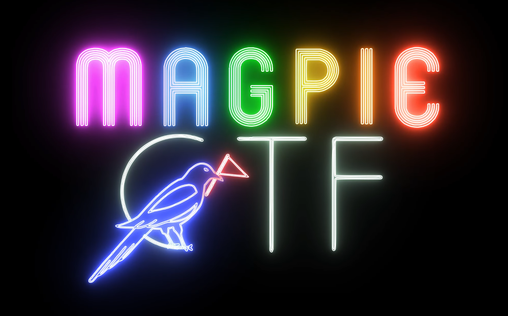

# magpieCTF 2021

## Overview
This repository contains challenges and other resources for magpieCTF 2021.

Courtesy of the University of Calgary Information Security Club ([https://infosecucalgary.ca/](https://infosecucalgary.ca/)).

**NOTE: This repository will be set to public after the CTF. Do not commit any sensitive passwords or API keys.**