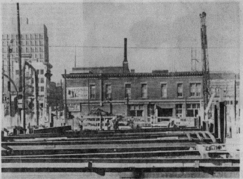

# Newsworthy
### Category: OSINT
### Author: Emily Baird (Analytical Engine)

## Description
What 3 words best describe the National billboard on the front page of the Calgary Herald on March 27th 1980?

Flag format: magpie{word1.word2.word3} 

## Hints
GPS coordinates aren’t the only way of accurately expressing a location

## Solution
The entire archives of the Calgary Herald from 1883-2010 are online [here](https://web.calgarylibrary.ca/read-learn-and-explore/digital-library/calgary-herald-archive-online/). By searching for March 27, 1980, we can find a copy of the paper from that day. The picture on the front page shows a construction site in the foreground with a heritage building in the background. We can faintly see an advertisement on the side of the building, with the word “National” visible.

Now that we’ve found the image, we still need to figure out what to do with it to find the flag. The description says that the flag is “What 3 words best describe…?” What3words is a project that maps a 3-meter by 3-meter grid onto the entire surface of the world, and assigns each square a name of 3 random English words. We can infer that the flag is probably the what3words entry for the location of the sign. The description underneath states that the photo was taken on the corner of Macleod Trail and 12th Avenue SE in Calgary, AB. 

On Google maps, we can use streetview to take a look at the area now. The heritage building has been renovated slightly, but it’s still there. The building in question is the Louise Block building on Macleod Trail and 11th Avenue (the photo in the paper was taken on 12th looking one block north). If we find that location on [What3Words](https://what3words.com/), we learn that the square on the map is called “boxer.jacket.hoofs” which also lines up nicely with what we know of the flag format, giving us some extra confidence that this is our flag.

## Flag
magpie{boxer.jacket.hoofs} 